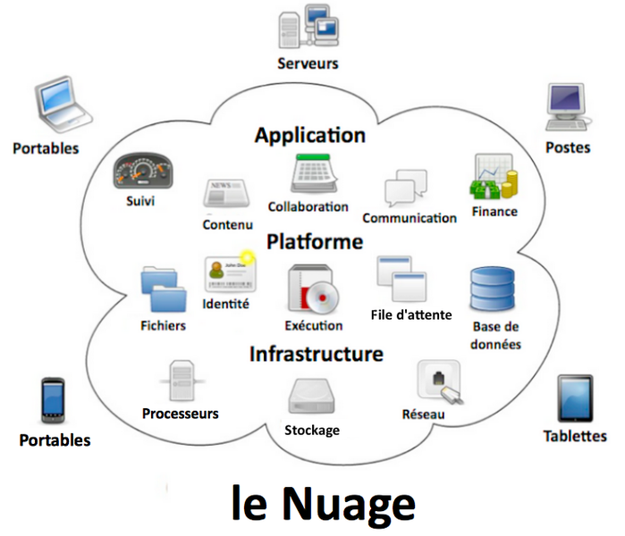
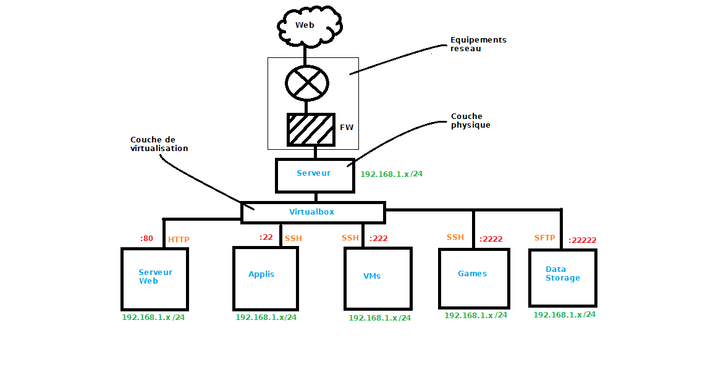
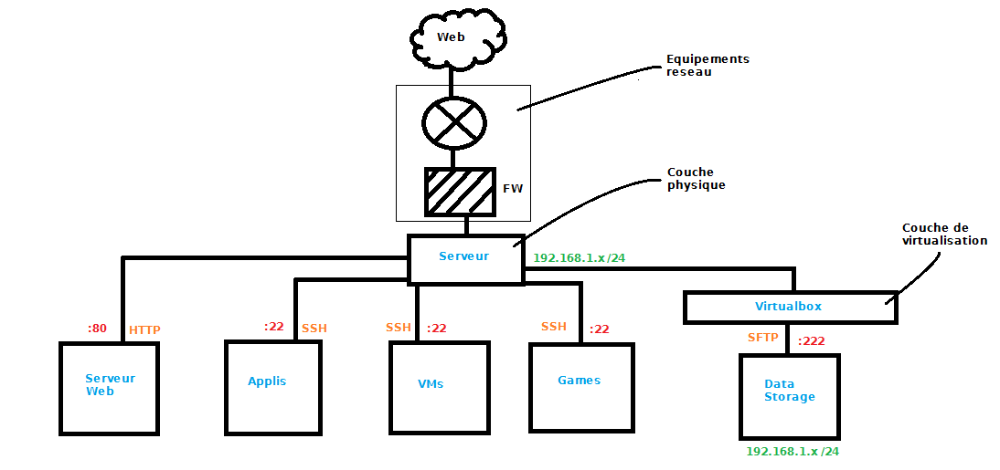
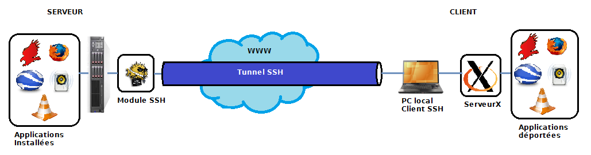
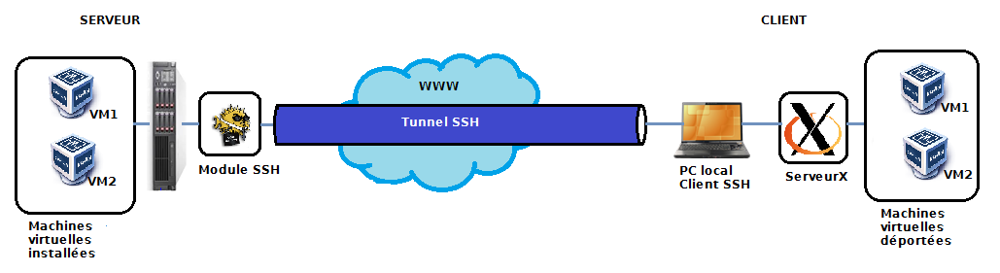
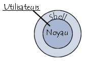

Cloudi
=============
Nouveaux services au sein de l'architecture cloud

# Généralités  
## Présentation Projet  
Depuis quelques années, les technologies informatiques et les systèmes d'informations ont grandement évolué et ont permis de développer des solutions de cloud computing, dit aussi informatique en nuage (en français). Ce projet a pour but de présenter une solution de cloud computing délivrant un ensemble de services à l'utilisateur.  
Pour rappel, le cloud computing consiste à déporter des données ou/et des traitements informatiques sur des serveurs distants (les nuages) et d'utiliser ces ressources à travers internet ou des réseaux d'entreprises.  

Dans ce projet plusieurs services sont mis en place : accès à des applications, création/gestion de machines virtuelles et gestion de fichiers. L'ensemble de ces services est accessible depuis une interface utilisateur unique à distance. Ainsi l'utilisateur peut par exemple lancer des applications sans les installer sur son ordinateur personnel ou encore utiliser d'autres systèmes exploitations.  
Ce projet reprend des idées de grandes entreprises présentes sur le marché du cloud tel que Amazon Web Services ou Google avec cependant pour particularité de n'utiliser que des outils ou projets OpenSource. Il a également pour but de montrer qu'il est possible de monter un serveur « Cloud » multiservices de façon assez simple et rapide. 
## Architecture  
### Virtualisée  

L'architecture virtualisée se compose de 6 machines (1 physique et 5 virtualisées). L'avantage de la virtualisation est la modularité, ainsi on peut associer à un service donné une machine virtuelle particulière, ce qui est proposé ici. De plus, chaque machine virtuelle est indépendante et si l'une des machines tombent en panne, seul le service associé ne fonctionnera pas. Le serveur physique assure le bon fonctionnement des machines virtuelles. Cependant la complexité de mise en œuvre est plus importante, notamment avec la gestion des utilisateurs qui doit être effectuée sur chaque machine.  
Note : toutes les machines sont sous Linux (Ubuntu 12.04 LTS)
### Non virtualisée  

L'architecture non virtualisée se compose de 2 machines (1 physique et 1 virtualisée). Ses avantages et désavantages sont à l'opposé de l'architecture totalement virtualisée. En effet, on a une concentration des services sur la machine mais une complexité de mise en œuvre plus faible (même exemple avec gestion d'utilisateurs). On peut noter tout de même que la gestion de fichiers est virtualisée, on verra plus bas pourquoi.  
Note : toutes les machines sont sous Linux (Ubuntu 12.04 LTS)  
# Techniques et fonctionnement   
## Le serveur web  
Il va stocker et constituer l'interface unique pour l'utilisateur. Il est composé de divers paquets :  
→ Apache, qui permet la configuration et la mise en place du serveur à proprement parler.  
→ PHP, qui est rattaché à Apache et permet d'utiliser le langage php sur le serveur.  
→ MySQL, qui constitue la base de données.  
Note : Cette configuration est très populaire sur le web à tel point qu'elle possède un acronyme, la configuration LAMP (Linux, Apache, MySQL, PHP).   
Grâce au php sur le serveur on peut communiquer avec la base de données et effectuer des opérations en son sein (écriture, lecture..).  
### Configuration  
Terminal :  
```
sudo apt-get install apache2 apache2-utils php5 php5-dev php5-gd
```  
Vérifier le fichier «security ».  
```
sudo gedit /etc/apache2/conf.d/security
```

Vérifier que les 3 lignes suivantes sont écrites de cette manière :   
```  
ServerTokens Prod	    
Server Signature Off	        
TraceEnable Off	  
```  

Il faut maintenant créer le fichier relatif au site web (le VirtualHost).  
```
sudo gedit /etc/apache2/sites-available/monsiteweb
```  

Dans ce fichier on va placer des infos relatives au site que l'on va créer : alias, mail de l'admin...  
```  
# Le virtualHost de monsite.fr
<VirtualHost *:80>
    ServerAdmin webmaster@monsite.fr        # L'E-Mail de l'administrateur
    ServerName  monsite.fr                  # L'adresse du site
    ServerAlias www.monsite.fr monsite.com  # Les alias du site
    
    # Les documents du site (Souvent /var/www ou /home/monsite)
    DocumentRoot /var/www
	# Les options du site (comme dans un .htaccess)
    <Directory /var/www/>
        # On autorise tous le monde a voir le site
        Order allow,deny
        allow from all
    </Directory>
    
    # Les logs (historiques des IPs et des fichiers envoyés)
    ErrorLog /var/log/apache2/monsite.fr-error_log      # Erreurs
    TransferLog /var/log/apache2/monsite.fr-access_log  # Acces
</VirtualHost>  
```  

Redémarrer le serveur web.  
```
sudo /etc/init.d/apache2 restart 
```  

Tester en lançant votre navigateur web puis taper localhost dans la barre d'adresse, si tout marche correctement, une page s'affiche avec un «It works ! » en gras.  
A présent il est temps de passer à l'installation du serveur sql qui va permettre la gestion de la base de données. On va installer Mysql.  
```
sudo apt-get install mysql-server php5-mysql
```  
Il est possible qu'on demande un mot de passe. Ce mot de passe permet de se connecter au serveur de base de données en mode « root » (utilisateur=root).  

## La virtualisation d'applications  
Cette technique va nous permettre de mettre en place le service d'accès à distance aux applications. L'idée est de lancer l'application sur le serveur puis de déporter le flux de données (provenant du processus dans ce cas) vers la machine du client. Ce dernier récupérera ce flux pour afficher l'application sur son ordinateur. Le flux de données circule à travers un canal SSH, tant que le canal perdure ou que l'application n'est pas stoppée, le processus reste en mémoire et actif sur le serveur.  
A noter qu'à aucun moment le processus ne va se « déporter » sur la machine client, c'est seulement son flux, l'application va donc utiliser les ressources physiques du serveur et non celles de l'utilisateur.   
Techniquement on utilise une propriété des canaux SSH très intéressante nommée X11 Forwarding qui permet de déporter l'affichage graphique du processus vers la machine de l'utilisateur.  
Note : Le son n'est pas pris ne compte, il n' a que l'affichage.  
L'utilisateur récupère ces données de façon constante et les affiche localement à l'aide d'un serveur X. Le serveur X est un utilitaire (ou logiciel) dérivé du système fenêtré X (nommé aussi X11) qui gère l'interaction homme-machine par l'écran, la souris et le clavier.  Ainsi l'utilisateur peut utiliser une application depuis le serveur en local.  

Le système utilise 3 logiciels pour pouvoir fonctionner :   
→ OpenSSH, qui permet la configuration et la mise en place du serveur SSH.  
→ MindTerm, qui est le client SSH, il permet la communication avec le serveur.  
→ Xming, qui est le serveur X le plus réputé sur Windows.  
Note : Sur Mac et Linux il n'y a pas besoin de logiciel de serveur X car ceux ci sont généralement intégrés dans les paquets de la distribution.  

### Configuration  
Terminal :  
```
sudo apt-get install openssh-server
```  

Le serveur SSH est installé, il reste juste à vérifier les paramètres de celui-ci.   
```
sudo gedit /etc/ssh/sshd_config
```  

Vérifier que « X11Forwarding » est à « yes »  

## La virtualisation de machines  
Cette technique va nous permettre de mettre en place le service de création/gestion de machines virtuelles. On utilise la même méthode que pour les applications, la seule différence est que le processus est une machine virtuelle gérée par un logiciel particulier : VirtualBox. Ce logiciel, à mi chemin entre l'émulateur et l'hyperviseur, permet de virtualiser du matériel informatique physique ainsi que son contenu (OS, logiciels...). Il possède beaucoup d'avantages comme le fait d'être OpenSource, facile d'utilisation et exploitable en lignes de commandes mais possède un désavantage majeur : ses performances sont assez moyennes comparées à celles d'un hyperviseur.  
La virtualisation des ressources physiques est avantageuse car on peut allouer ces ressources comme bon nous semble dans la limite des ressources disponibles. Ainsi il est possible d'allouer un certain nombre de méga /giga octets de mémoire vive  ou de mémoire morte à notre machine ou encore de choisir le nombre de processeurs et donc de personnaliser chaque machine.  
L'idée est de donner la possibilité à l'utilisateur de créer des machines virtuelles, avec une limite en ressources,  de les gérer et de les supprimer à travers l'interface. On utilise pour cela les commandes de Virtualbox sous Linux (regroupées en script) qui sont extrêmement puissantes (notamment « vboxmanage ») puis pour l'affichage on utilise la même méthode que pour les applications.  
Note : pour plus d'infos sur la virtualisation, aller plus bas en annexe.  
  
### Utilisation Virtualbox  
Le manuel de référence pour Virtualbox avec notamment le chapitre 8 où se trouve vboxmanage. [Manual here](http://www.virtualbox.org/manual/)

## La sécurité par emprisonnement  
Comme vu dans les 2 dernières parties, on utilise abondement la communication SSH et son système d'accès à distance bien pratique. Cependant, laissé comme tel, il permet l'accès en lignes de commandes au serveur (architecture 2 tiers du protocole SSH) et est donc un grand danger pour l'ensemble du système que l'on met en place. C'est ici qu'intervient le shell limité sous Linux.  
  
Le shell est l'interpréteur de commandes du système 
d'exploitation, il est chargé de faire l'intermédiaire entre le noyau
du système et l'utilisateur. De base sous Linux on possède un 
shell non limité c'est a dire qu'il est possible de taper toutes les 
commandes offertes par les paquets installés sur le système.   
L'idée du shell limité est d'emprisonner l'utilisateur pour qu'il 
n'ait accès qu'à certaines commandes et de bannir les autres.   
Note : Un shell est unique par utilisateur. Il est possible de 
le modifier mais pas d'en attribuer plusieurs pour un utilisateur.    
Pour mettre en place cette limitation on utilise un projet OpenSource nommé lshell (limitedshell) qui répond à la perfection à cette problématique. Il permet de restreindre le shell pour un utilisateur donné et de contraindre ce dernier de n'utiliser que certaines commandes à travers un canal SSH. Ainsi l'accès au serveur par l'utilisateur ne peut se faire que par SSH et avec les commandes qui lui sont attribuées, c'est à dire les applications et les scripts pour l'utilisation des VMs.  
### Configuration  
```
sudo apt-get install lshell  
sudo gedit /etc/lshell.conf  
```  
Exemple de configuration :  
```  
# lshell.py configuration file 
# 
# $Id: lshell.conf,v 1.27 2010-10-18 19:05:17 ghantoos Exp $ 

[global] 
##  log directory (default /var/log/lshell/ ) 
logpath         : /var/log/lshell/ 
##  set log level to 0, 1, 2, 3 or 4  (0: no logs, 1: least verbose, 
##                                                 4: log all commands) 
loglevel        : 2 
##  configure log file name (default is %u i.e. username.log) 
#logfilename     : %y%m%d-%u 
#logfilename     : syslog 

##  in case you are using syslog, you can choose your logname 
#syslogname      : myapp 

[default] 
##  a list of the allowed commands or 'all' to allow all commands in user's PATH 
allowed         : [] 

##  a list of forbidden character or commands -- deny vim, as it allows to escape lshell 
forbidden       : [';', '&', '|','`','>','<', '$(', '${', 'ls','cd','ll','echo','?','help','sudo','su','rm','mkfs','%',':','(','mv','cp','dd','chmod','chown','shred','sed','kill','slay','sa','gksudo','ps','top','scp'] 

##  a list of allowed command to use with sudo(8) 
#sudo_commands   : ['ls', 'more'] 

##  number of warnings when user enters a forbidden value before getting 
##  exited from lshell, set to -1 to disable. 
warning_counter : 0 

##  command aliases list (similar to bash’s alias directive) 
aliases         : {'ll':'ls -l', 'vim':'rvim'} 

##  introduction text to print (when entering lshell) 
#intro           : "== My personal intro ==\nWelcome to lshell\nType '?' or 'help' to get the list of allowed commands" 
intro		 : "Ook. Ook. Ook. Ook! Ook? Ook. Ook?\n" 

##  configure your promt using %u or %h (default: username) 
#prompt          : "%u@%h" 

##  set sort prompt current directory update (default: 0) 
#prompt_short    : 0 

##  a value in seconds for the session timer 
#timer           : 5 

##  list of path to restrict the user "geographicaly" 
#path            : ['/home/bla/','/etc'] 
path	 	 : ['/home/paco/'] 

##  set the home folder of your user. If not specified the home_path is set to 
##  the $HOME environment variable 
#home_path       : '/home/bla/' 

##  update the environment variable $PATH of the user 
#env_path        : ':/usr/local/bin:/usr/sbin' 

##  a list of path; all executable files inside these path will be allowed 
allowed_cmd_path: ['/home/paco/'] 

##  add environment variables 
#env_vars        : {'foo':1, 'bar':'helloworld'} 

##  allow or forbid the use of scp (set to 1 or 0) 
#scp             : 1 

## forbid scp upload 
#scp_upload       : 0 

## forbid scp download 
#scp_download     : 0 

##  allow of forbid the use of sftp (set to 1 or 0) 
#sftp            : 1 

##  list of command allowed to execute over ssh (e.g. rsync, rdiff-backup, etc.) 
#overssh         : ['ls', 'rsync'] 
overssh         : ['wine','firefox','arduino','gedit','eagle','blender','codeblocks','fraqtive','geogebra','gelemental','gimp','google-earth','libreoffice','marble','minetest','netbeans','rhythmbox','skype','stellarium','vlc','filezilla'] 

##  logging strictness. If set to 1, any unknown command is considered as 
##  forbidden, and user's warning counter is decreased. If set to 0, command is 
##  considered as unknown, and user is only warned (i.e. *** unknown synthax) 
strict          : 1 

##  force files sent through scp to a specific directory 
#scpforce        : '/home/bla/uploads/' 

##  history file maximum size 
#history_size     : 100 

##  set history file name (default is /home/%u/.lhistory) 
#history_file     : "/home/%u/.lshell_history" 

##  define the script to run at user login 
#login_script     : "/path/to/myscript.sh" 

[testsftp] 
overssh         : ['wine','firefox','arduino','gedit','eagle','blender','codeblocks','fraqtive','geogebra','gelemental','gimp','google-earth','libreoffice','marble','minetest','netbeans','rhythmbox','skype','stellarium','vlc','filezilla','/home/paco/Scripttestsftp/testsftpwinekeil.sh','/home/paco/Scripttestsftp/testsftpwinepspice.sh','/home/paco/Scripttestsftp/testsftptest.sh','/home/paco/Scripttestsftp/testsftptestbis.sh','/home/paco/Scripttestsftp/testsftptestter.sh','/home/paco/Scripttestsftp/testsftptestreseau.sh','/home/paco/Scripttestsftp/testsftptestreseaubis.sh','/home/paco/Scripttestsftp/testsftptestreseauter.sh','/home/paco/Scripttestsftp/testsftptestreseaunat.sh','/home/paco/Scripttestsftp/testsftpwinegba.sh'] 

[eblas] 
overssh         : ['wine','firefox','arduino','gedit','eagle','blender','codeblocks','fraqtive','geogebra','gelemental','gimp','google-earth','libreoffice','marble','minetest','netbeans','rhythmbox','skype','stellarium','vlc','filezilla','/home/paco/Scripteblas/eblaspwinekeil.sh','/home/paco/Scripteblas/eblaswinepspice.sh','/home/paco/Scripteblas/eblastest.sh','/home/paco/Scripteblas/eblastestbis.sh','/home/paco/Scripteblas/eblastestter.sh','/home/paco/Scripteblas/eblastestreseau.sh','/home/paco/Scripteblas/eblastestreseaubis.sh','/home/paco/Scripteblas/eblastestreseauter.sh','/home/paco/Scripteblas/eblastestreseaunat.sh','/home/paco/Scripteblas/eblaswinegba.sh'] 

[fblas] 
overssh         : ['wine','firefox','arduino','gedit','eagle','blender','codeblocks','fraqtive','geogebra','gelemental','gimp','google-earth','libreoffice','marble','minetest','netbeans','rhythmbox','skype','stellarium','vlc','filezilla','/home/paco/Scriptfblas/fblaswinekeil.sh','/home/paco/Scriptfblas/fblaswinepspice.sh','/home/paco/Scriptfblas/fblastest.sh','/home/paco/Scriptfblas/fblastestbis.sh','/home/paco/Scriptfblas/fblastestter.sh','/home/paco/Scriptfblas/fblastestreseau.sh','/home/paco/Scriptfblas/fblastestreseaubis.sh','/home/paco/Scriptfblas/fblastestreseauter.sh','/home/paco/Scriptfblas/fblastestreseaunat.sh','/home/paco/Scriptfblas/fblaswinegba.sh']
```    
lol