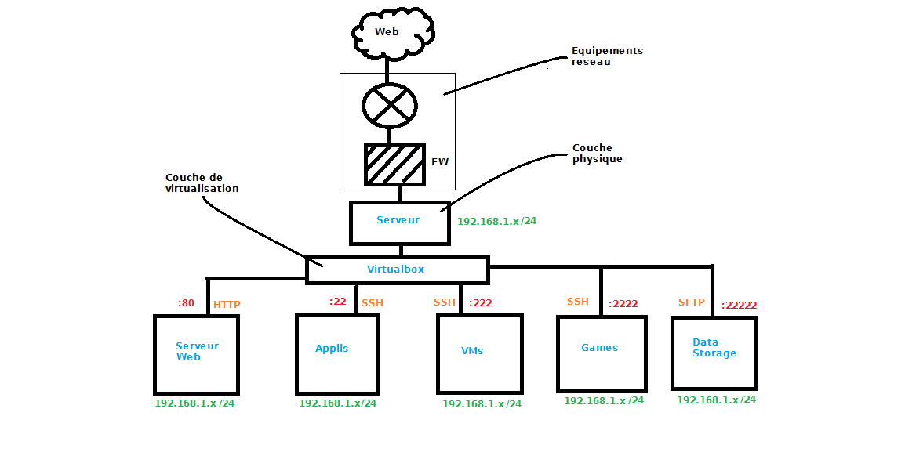
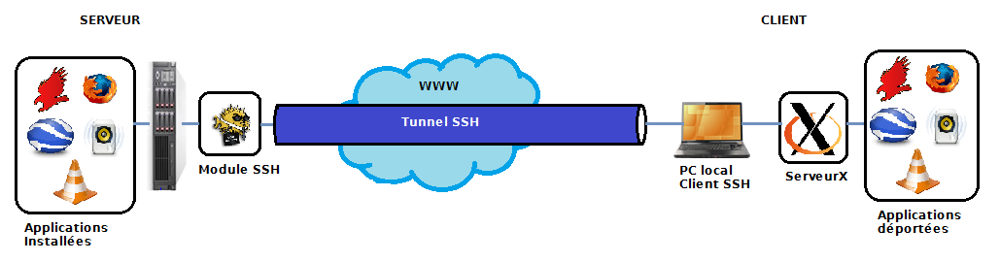
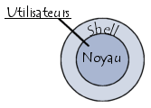

Cloudi
=============
Nouveaux services au sein de l'architecture cloud

# Généralités  
## Présentation Projet  
Depuis quelques années, les technologies informatiques et les systèmes d'informations ont grandement évolué et ont permis de développer des solutions de cloud computing, dit aussi informatique en nuage (en français). Ce projet a pour but de présenter une solution de cloud computing délivrant un ensemble de services à l'utilisateur.  
Pour rappel, le cloud computing consiste à déporter des données ou/et des traitements informatiques sur des serveurs distants (les nuages) et d'utiliser ces ressources à travers internet ou des réseaux d'entreprises.  

Dans ce projet plusieurs services sont mis en place : accès à des applications, création/gestion de machines virtuelles et gestion de fichiers. L'ensemble de ces services est accessible depuis une interface utilisateur unique à distance. Ainsi l'utilisateur peut par exemple lancer des applications sans les installer sur son ordinateur personnel ou encore utiliser d'autres systèmes exploitations.  
Ce projet reprend des idées de grandes entreprises présentes sur le marché du cloud tel que Amazon Web Services ou Google avec cependant pour particularité de n'utiliser que des outils ou projets OpenSource. Il a également pour but de montrer qu'il est possible de monter un serveur « Cloud » multiservices de façon assez simple et rapide. 
## Architecture  
### Virtualisée  

L'architecture virtualisée se compose de 6 machines (1 physique et 5 virtualisées). L'avantage de la virtualisation est la modularité, ainsi on peut associer à un service donné une machine virtuelle particulière, ce qui est proposé ici. De plus, chaque machine virtuelle est indépendante et si l'une des machines tombent en panne, seul le service associé ne fonctionnera pas. Le serveur physique assure le bon fonctionnement des machines virtuelles. Cependant la complexité de mise en œuvre est plus importante, notamment avec la gestion des utilisateurs qui doit être effectuée sur chaque machine.  
Note : toutes les machines sont sous Linux (Ubuntu 12.04 LTS)
### Non virtualisée  

L'architecture non virtualisée se compose de 2 machines (1 physique et 1 virtualisée). Ses avantages et désavantages sont à l'opposé de l'architecture totalement virtualisée. En effet, on a une concentration des services sur la machine mais une complexité de mise en œuvre plus faible (même exemple avec gestion d'utilisateurs). On peut noter tout de même que la gestion de fichiers est virtualisée, on verra plus bas pourquoi.  
Note : toutes les machines sont sous Linux (Ubuntu 12.04 LTS)  
# Techniques et fonctionnement   
## Le serveur web  
Il va stocker et constituer l'interface unique pour l'utilisateur. Il est composé de divers paquets :  
→ Apache, qui permet la configuration et la mise en place du serveur à proprement parler.  
→ PHP, qui est rattaché à Apache et permet d'utiliser le langage php sur le serveur.  
→ MySQL, qui constitue la base de données.  
Note : Cette configuration est très populaire sur le web à tel point qu'elle possède un acronyme, la configuration LAMP (Linux, Apache, MySQL, PHP).   
Grâce au php sur le serveur on peut communiquer avec la base de données et effectuer des opérations en son sein (écriture, lecture..).  
### Configuration  
Terminal :  
```
sudo apt-get install apache2 apache2-utils php5 php5-dev php5-gd
```  
Vérifier le fichier «security ».  
```
sudo gedit /etc/apache2/conf.d/security
```

Vérifier que les 3 lignes suivantes sont écrites de cette manière :   
```  
ServerTokens Prod	    
Server Signature Off	        
TraceEnable Off	  
```  

Il faut maintenant créer le fichier relatif au site web (le VirtualHost).  
```
sudo gedit /etc/apache2/sites-available/monsiteweb
```  

Dans ce fichier on va placer des infos relatives au site que l'on va créer : alias, mail de l'admin...  
```  
# Le virtualHost de monsite.fr
<VirtualHost *:80>
    ServerAdmin webmaster@monsite.fr        # L'E-Mail de l'administrateur
    ServerName  monsite.fr                  # L'adresse du site
    ServerAlias www.monsite.fr monsite.com  # Les alias du site
    
    # Les documents du site (Souvent /var/www ou /home/monsite)
    DocumentRoot /var/www
	# Les options du site (comme dans un .htaccess)
    <Directory /var/www/>
        # On autorise tous le monde a voir le site
        Order allow,deny
        allow from all
    </Directory>
    
    # Les logs (historiques des IPs et des fichiers envoyés)
    ErrorLog /var/log/apache2/monsite.fr-error_log      # Erreurs
    TransferLog /var/log/apache2/monsite.fr-access_log  # Acces
</VirtualHost>  
```  

Redémarrer le serveur web.  
```
sudo /etc/init.d/apache2 restart 
```  

Tester en lançant votre navigateur web puis taper localhost dans la barre d'adresse, si tout marche correctement, une page s'affiche avec un «It works ! » en gras.  
A présent il est temps de passer à l'installation du serveur sql qui va permettre la gestion de la base de données. On va installer Mysql.  
```
sudo apt-get install mysql-server php5-mysql
```  
Il est possible qu'on demande un mot de passe. Ce mot de passe permet de se connecter au serveur de base de données en mode « root » (utilisateur=root).  

## La virtualisation d'applications  
Cette technique va nous permettre de mettre en place le service d'accès à distance aux applications. L'idée est de lancer l'application sur le serveur puis de déporter le flux de données (provenant du processus dans ce cas) vers la machine du client. Ce dernier récupérera ce flux pour afficher l'application sur son ordinateur. Le flux de données circule à travers un canal SSH, tant que le canal perdure ou que l'application n'est pas stoppée, le processus reste en mémoire et actif sur le serveur.  
A noter qu'à aucun moment le processus ne va se « déporter » sur la machine client, c'est seulement son flux, l'application va donc utiliser les ressources physiques du serveur et non celles de l'utilisateur.   
Techniquement on utilise une propriété des canaux SSH très intéressante nommée X11 Forwarding qui permet de déporter l'affichage graphique du processus vers la machine de l'utilisateur.  
Note : Le son n'est pas pris ne compte, il n' a que l'affichage.  
L'utilisateur récupère ces données de façon constante et les affiche localement à l'aide d'un serveur X. Le serveur X est un utilitaire (ou logiciel) dérivé du système fenêtré X (nommé aussi X11) qui gère l'interaction homme-machine par l'écran, la souris et le clavier.  Ainsi l'utilisateur peut utiliser une application depuis le serveur en local.  

Le système utilise 3 logiciels pour pouvoir fonctionner :   
→ OpenSSH, qui permet la configuration et la mise en place du serveur SSH.  
→ MindTerm, qui est le client SSH, il permet la communication avec le serveur.  
→ Xming, qui est le serveur X le plus réputé sur Windows.  
Note : Sur Mac et Linux il n'y a pas besoin de logiciel de serveur X car ceux ci sont généralement intégrés dans les paquets de la distribution.  

### Configuration  
Terminal :  
```
sudo apt-get install openssh-server
```  

Le serveur SSH est installé, il reste juste à vérifier les paramètres de celui-ci.   
```
sudo gedit /etc/ssh/sshd_config
```  

Vérifier que « X11Forwarding » est à « yes »  

## La virtualisation de machines  
Cette technique va nous permettre de mettre en place le service de création/gestion de machines virtuelles. On utilise la même méthode que pour les applications, la seule différence est que le processus est une machine virtuelle gérée par un logiciel particulier : VirtualBox. Ce logiciel, à mi chemin entre l'émulateur et l'hyperviseur, permet de virtualiser du matériel informatique physique ainsi que son contenu (OS, logiciels...). Il possède beaucoup d'avantages comme le fait d'être OpenSource, facile d'utilisation et exploitable en lignes de commandes mais possède un désavantage majeur : ses performances sont assez moyennes comparées à celles d'un hyperviseur.  
La virtualisation des ressources physiques est avantageuse car on peut allouer ces ressources comme bon nous semble dans la limite des ressources disponibles. Ainsi il est possible d'allouer un certain nombre de méga /giga octets de mémoire vive  ou de mémoire morte à notre machine ou encore de choisir le nombre de processeurs et donc de personnaliser chaque machine.  
L'idée est de donner la possibilité à l'utilisateur de créer des machines virtuelles, avec une limite en ressources,  de les gérer et de les supprimer à travers l'interface. On utilise pour cela les commandes de Virtualbox sous Linux (regroupées en script) qui sont extrêmement puissantes (notamment « vboxmanage ») puis pour l'affichage on utilise la même méthode que pour les applications.  
Note : pour plus d'infos sur la virtualisation, aller plus bas en annexe.  
  
### Utilisation Virtualbox  
Le manuel de référence pour Virtualbox avec notamment le chapitre 8 où se trouve vboxmanage. [Manual here](http://www.virtualbox.org/manual/)

## La sécurité par emprisonnement  
Comme vu dans les 2 dernières parties, on utilise abondement la communication SSH et son système d'accès à distance bien pratique. Cependant, laissé comme tel, il permet l'accès en lignes de commandes au serveur (architecture 2 tiers du protocole SSH) et est donc un grand danger pour l'ensemble du système que l'on met en place. C'est ici qu'intervient le shell limité sous Linux.  
  
Le shell est l'interpréteur de commandes du système 
d'exploitation, il est chargé de faire l'intermédiaire entre le noyau
du système et l'utilisateur. De base sous Linux on possède un 
shell non limité c'est a dire qu'il est possible de taper toutes les 
commandes offertes par les paquets installés sur le système.   
L'idée du shell limité est d'emprisonner l'utilisateur pour qu'il 
n'ait accès qu'à certaines commandes et de bannir les autres.   
Note : Un shell est unique par utilisateur. Il est possible de 
le modifier mais pas d'en attribuer plusieurs pour un utilisateur.    
Pour mettre en place cette limitation on utilise un projet OpenSource nommé lshell (limitedshell) qui répond à la perfection à cette problématique. Il permet de restreindre le shell pour un utilisateur donné et de contraindre ce dernier de n'utiliser que certaines commandes à travers un canal SSH. Ainsi l'accès au serveur par l'utilisateur ne peut se faire que par SSH et avec les commandes qui lui sont attribuées, c'est à dire les applications et les scripts pour l'utilisation des VMs.  
### Configuration  
```
sudo apt-get install lshell  
sudo gedit /etc/lshell.conf  
```  
Exemple de configuration :  
```  
# lshell.py configuration file 
# 
# $Id: lshell.conf,v 1.27 2010-10-18 19:05:17 ghantoos Exp $ 

[global] 
##  log directory (default /var/log/lshell/ ) 
logpath         : /var/log/lshell/ 
##  set log level to 0, 1, 2, 3 or 4  (0: no logs, 1: least verbose, 
##                                                 4: log all commands) 
loglevel        : 2 
##  configure log file name (default is %u i.e. username.log) 
#logfilename     : %y%m%d-%u 
#logfilename     : syslog 

##  in case you are using syslog, you can choose your logname 
#syslogname      : myapp 

[default] 
##  a list of the allowed commands or 'all' to allow all commands in user's PATH 
allowed         : [] 

##  a list of forbidden character or commands -- deny vim, as it allows to escape lshell 
forbidden       : [';', '&', '|','`','>','<', '$(', '${', 'ls','cd','ll','echo','?','help','sudo','su','rm','mkfs','%',':','(','mv','cp','dd','chmod','chown','shred','sed','kill','slay','sa','gksudo','ps','top','scp'] 

##  a list of allowed command to use with sudo(8) 
#sudo_commands   : ['ls', 'more'] 

##  number of warnings when user enters a forbidden value before getting 
##  exited from lshell, set to -1 to disable. 
warning_counter : 0 

##  command aliases list (similar to bash’s alias directive) 
aliases         : {'ll':'ls -l', 'vim':'rvim'} 

##  introduction text to print (when entering lshell) 
#intro           : "== My personal intro ==\nWelcome to lshell\nType '?' or 'help' to get the list of allowed commands" 
intro		 : "Ook. Ook. Ook. Ook! Ook? Ook. Ook?\n" 

##  configure your promt using %u or %h (default: username) 
#prompt          : "%u@%h" 

##  set sort prompt current directory update (default: 0) 
#prompt_short    : 0 

##  a value in seconds for the session timer 
#timer           : 5 

##  list of path to restrict the user "geographicaly" 
#path            : ['/home/bla/','/etc'] 
path	 	 : ['/home/paco/'] 

##  set the home folder of your user. If not specified the home_path is set to 
##  the $HOME environment variable 
#home_path       : '/home/bla/' 

##  update the environment variable $PATH of the user 
#env_path        : ':/usr/local/bin:/usr/sbin' 

##  a list of path; all executable files inside these path will be allowed 
allowed_cmd_path: ['/home/paco/'] 

##  add environment variables 
#env_vars        : {'foo':1, 'bar':'helloworld'} 

##  allow or forbid the use of scp (set to 1 or 0) 
#scp             : 1 

## forbid scp upload 
#scp_upload       : 0 

## forbid scp download 
#scp_download     : 0 

##  allow of forbid the use of sftp (set to 1 or 0) 
#sftp            : 1 

##  list of command allowed to execute over ssh (e.g. rsync, rdiff-backup, etc.) 
#overssh         : ['ls', 'rsync'] 
overssh         : ['wine','firefox','arduino','gedit','eagle','blender','codeblocks','fraqtive','geogebra','gelemental','gimp','google-earth','libreoffice','marble','minetest','netbeans','rhythmbox','skype','stellarium','vlc','filezilla'] 

##  logging strictness. If set to 1, any unknown command is considered as 
##  forbidden, and user's warning counter is decreased. If set to 0, command is 
##  considered as unknown, and user is only warned (i.e. *** unknown synthax) 
strict          : 1 

##  force files sent through scp to a specific directory 
#scpforce        : '/home/bla/uploads/' 

##  history file maximum size 
#history_size     : 100 

##  set history file name (default is /home/%u/.lhistory) 
#history_file     : "/home/%u/.lshell_history" 

##  define the script to run at user login 
#login_script     : "/path/to/myscript.sh" 

[testsftp] 
overssh         : ['wine','firefox','arduino','gedit','eagle','blender','codeblocks','fraqtive','geogebra','gelemental','gimp','google-earth','libreoffice','marble','minetest','netbeans','rhythmbox','skype','stellarium','vlc','filezilla','/home/paco/Scripttestsftp/testsftpwinekeil.sh','/home/paco/Scripttestsftp/testsftpwinepspice.sh','/home/paco/Scripttestsftp/testsftptest.sh','/home/paco/Scripttestsftp/testsftptestbis.sh','/home/paco/Scripttestsftp/testsftptestter.sh','/home/paco/Scripttestsftp/testsftptestreseau.sh','/home/paco/Scripttestsftp/testsftptestreseaubis.sh','/home/paco/Scripttestsftp/testsftptestreseauter.sh','/home/paco/Scripttestsftp/testsftptestreseaunat.sh','/home/paco/Scripttestsftp/testsftpwinegba.sh'] 

[eblas] 
overssh         : ['wine','firefox','arduino','gedit','eagle','blender','codeblocks','fraqtive','geogebra','gelemental','gimp','google-earth','libreoffice','marble','minetest','netbeans','rhythmbox','skype','stellarium','vlc','filezilla','/home/paco/Scripteblas/eblaspwinekeil.sh','/home/paco/Scripteblas/eblaswinepspice.sh','/home/paco/Scripteblas/eblastest.sh','/home/paco/Scripteblas/eblastestbis.sh','/home/paco/Scripteblas/eblastestter.sh','/home/paco/Scripteblas/eblastestreseau.sh','/home/paco/Scripteblas/eblastestreseaubis.sh','/home/paco/Scripteblas/eblastestreseauter.sh','/home/paco/Scripteblas/eblastestreseaunat.sh','/home/paco/Scripteblas/eblaswinegba.sh'] 

[fblas] 
overssh         : ['wine','firefox','arduino','gedit','eagle','blender','codeblocks','fraqtive','geogebra','gelemental','gimp','google-earth','libreoffice','marble','minetest','netbeans','rhythmbox','skype','stellarium','vlc','filezilla','/home/paco/Scriptfblas/fblaswinekeil.sh','/home/paco/Scriptfblas/fblaswinepspice.sh','/home/paco/Scriptfblas/fblastest.sh','/home/paco/Scriptfblas/fblastestbis.sh','/home/paco/Scriptfblas/fblastestter.sh','/home/paco/Scriptfblas/fblastestreseau.sh','/home/paco/Scriptfblas/fblastestreseaubis.sh','/home/paco/Scriptfblas/fblastestreseauter.sh','/home/paco/Scriptfblas/fblastestreseaunat.sh','/home/paco/Scriptfblas/fblaswinegba.sh']
```  
Plus d’infos : [Lshell](https://github.com/ghantoos/lshell)  

## La gestion des fichiers  
  
Pour gérer et transférer des fichiers il existe un protocole très connu nommé FTP. Malgré sa simplicité de mise en place sous Linux il reste néanmoins dangereux car il est non chiffré, ce qui fait que mots de passe ou noms d’utilisateurs passent en clair sur le réseau. Pour pallier à ce problème et dans un souci de cohérence avec le reste du projet, la gestion des fichiers se fait en SFTP. Ce protocole est une extension du précédent, on encapsule le protocole FTP dans un canal SSH afin d'en chiffrer le contenu.   
Un serveur SFTP est un simple serveur SSH sur lequel on emprisonne l'utilisateur (à la manière de lshell) et qu'on limite au transfert de fichiers.   
Pour mettre en place un serveur SFTP on utilise 2 utilitaires :   
→ OpenSSH, qui permet de gérer et créer le serveur SSH  
→ MySecureShell, qui permet de limiter le shell de l'utilisateur  
On utilise ici MySecureShell à la place de lshell (qui gère aussi le SFTP) tout simplement parce qu'il est dédié au SFTP donc beaucoup plus complet. On peut configurer précisément les débits d'upload et de téléchargements pour le serveur ou encore limiter le nombre de fichiers téléchargeables.   
Dans le chapitre sur l'architecture réseau il était question de mettre en place ce serveur sur une VM et non pas sur le serveur physique. Pourquoi ? La réponse est simple, comme il est dit au paragraphe précédent un shell est unique, or les utilisateurs sur le serveur physique sont déjà limités par lshell il est donc impossible de leurs attribuer celui de MySecureShell. C'est pourquoi on installe une VM spécifique pour le serveur SFTP.  

### Configuration  
La documentation pour la configuration se trouve [ici](http://doc.ubuntu-fr.org/mysecureshell_sftp-server).  

## Communication SSH  
Précédemment il est question de communication SSH entre un serveur et un client, cependant je n'ai évoqué que la partie serveur et pas le client. Le client SSH utilisé est une application codée en Java du nom de MindTerm. C'est une application codée à partir de bibliothèques SSH OpenSource permettant d’établir une communication SSH avec un serveur. Outre le fait qu'elle dispose de beaucoup d'options intéressantes, elle se démarque surtout par le fait qu'il est possible de l'utiliser en tant qu'applet web. Cela veut dire que l'application est intégrable dans une page web et utilisable à l'aide des plugin Java intégrés dans les navigateurs web actuels.  

### Configuration  
Utilisation en applet web :  
```
<object codetype='application/java-archive' classid='java:com.mindbright.application.MindTerm.class'
          archive='mindterm241.weaversigned.jar'>
    <param name='sepframe' value='true' />
    <param name='debug' value='true' />
    <param name='protocol' value='ssh2' />
    <param name='server' value="monserveur" />
    <param name='port' value='22' />
    <param name='alive' value='60' />
    <param name='username' value="user" />
    <param name='password' value="pwd" />	 
    <param name='quiet' value='true' />
	<param name='80x132-enable' value='true' />
    <param name='80x132-toggle' value='true' />
    <param name='bg-color' value='white' />
    <param name='fg-color' value='black' />
    <param name='cursor-color' value='i_black' />
    <param name='geometry' value='125x30' />	
    <param name='x11-forward' value='true' />
    <param name='x11-display' value='127.0.0.1:0' />
    <param name='compression' value='1' />	
    <param name='commandline' value="" />
   </object>
```

Description des options :  
protocol : Preferred protocol (auto/ssh1/ssh2)  
server : Name of server to connect to (see the quiet setting as well)  
port : Port on server to connect to (see the quiet setting as well)  
username : User name to login as (see the quiet setting as well)  
password : Password for normal authentication  
quiet : Don't query for server or user name if given  
compression : Compression Level (0 means none, 1=fast, 9=slow/best)  
x11-forward : Indicates whether X11 display is forwarded or not  
x11-display : Local display to forward  
commandline : Command to run on server  
alive : Connection keep-alive interval in seconds  
bg-color : Background color (<name> or '<r>,<g>,<b>')  
cursor-color : Cursor color (<name> or '<r>,<g>,<b>')  
fg-color : Foreground color (<name> or '<r>,<g>,<b>')  
geometry : Geometry of terminal ('<cols>x<rows>')  
debug : Set to true to generate debug output (on console)  
sepframe : True if the application should open in a separate frame  

# L'interface client  
C'est une interface unique sous forme de site web, qui regroupe l'ensemble des services cités auparavant. Elle propose en plus d'autres petits services propres au web tels que : des flux d'actualités (Flux RSS), un système de mail interne et un système de mémo.  

## Organisation générale  


## L'index  
L'index est la 1ère page qui apparaît lorsqu'un utilisateur se connecte sur le site web. Elle est simple et intuitive puisqu'elle ne se compose que de 2 formulaires : un pour l'inscription d'un nouvel utilisateur et l'autre pour la connexion d'un utilisateur déjà enregistré.  

### Formulaire d'inscription  
L'utilisateur rentre quelques données nécessaires (pseudo, mot de passe et mail) afin de se créer un compte puis clique sur enregistrer. Il est alors renvoyé sur une page ou vont s'effectuer des traitements en PHP: vérifications des données et comparaison avec la base de données, enregistrements divers dans la base de données et écriture des scripts nécessaires à la création d'un compte UNIX sur le serveur.  

### La connexion    
L'utilisateur est maintenant enregistré il peut donc se connecter sur son compte. Lors de la connexion un traitement est effectué afin de vérifier si l'utilisateur est enregistré ou non, si oui il est alors renvoyé sur la page principale du site web.  
Avant de détailler la page principale, il faut expliquer le système de compte utilisateur (dit aussi système de sessions en PHP).  

### Les sessions  
En PHP, il existe un ensemble de fonctions et variables permettant de définir un mécanisme de sessions qui reproduit cet effet de compte utilisateur. L'idée du mécanisme est de garder le compte utilisateur ouvert, depuis sa connexion jusqu'à sa déconnexion, et pouvoir faire transiter des variables de page en page sur le site web (comme son login par exemple). Ce système est très pratique et est utilisé par exemple lors d'une connexion à votre compte Google.  
Une session PHP à la particularité de se définir toujours au début d'une page web avant toute autre introduction de code (que ce soit PHP, HTML, Javascript ou autres) ! Cela permet de créer des mécanismes intéressant comme par exemple,  interdire l'accès à une page si l'utilisateur n'est pas connecté.  
Exemple :  
```
<?php
//demarage de session
session_start();

//Connexion Session
try
{
$bdd = new PDO('mysql:host=localhost;dbname=test', 'root', 'password');//connexion bdd 
}
catch(Exception $e)
{
die('Erreur : '.$e->getMessage());
}
$session1=$_SESSION['mdp'];
$session2=$_SESSION['login'];
$rep = $bdd->prepare("SELECT ID FROM Inscription WHERE motdepasse='$session1'");
$rep->execute(array());
$rep1 = $bdd->prepare("SELECT ID FROM Inscription WHERE pseudo='$session2'");
$rep1->execute(array());
$co=$rep->rowCount();
$co1=$rep1->rowCount();
if($co != 1 || $co1 != 1){header('Location: index.php');}//si login/mdp pas trouvé on renvoie a l'index
//-----------------------------------------------------------------------------
?>
```  

## La page principale  
La page principale se compose de 3 parties : le système de mémo, le système d'applications et le système de VMs.  

### La partie mémo  
Dans cette partie l’utilisateur peut lancer et gérer ses applications favorites. On affiche les applications que l'utilisateur a sélectionné en tant que favoris. Chaque application dispose d'un sous menu permettant à l'utilisateur de lancer l'application, obtenir des informations sur celle-ci et la retirer de ses favoris.  
L'ajout en favoris peut se faire de 2 manières : à travers un store d'applications sous forme de fenêtre popup ou bien à travers un input de recherche auto-complété. Lorsque l'utilisateur ajoute une application à ses favoris cela déclenche un processus PHP qui modifie la base de données, et vient remplacer le 0 par 1 dans la cellule qui fait la correspondance utilisateur/application.  
  
Le mécanisme est similaire lorsque l'utilisateur retire l'application de ses favoris, on remplace le 1 par 0.   
Note : l’affichage des favoris sur la page principale se fait simplement par une sélection des applications notées 1 dans la base de données pour l’utilisateur donné.  
Le sous menu permettant l'obtention d’informations renvoie l’utilisateur sur le site officiel de l'application sélectionnée.   
Enfin lorsque l'utilisateur lance une application il déclenche une nouvelle page sur laquelle on va lancer uniquement MindTerm. La communication SSH va alors s 'établir et on utilisera le X11 Forwarding pour déporter l'affichage de l'application depuis le serveur.  

### La partie VMs  
L'utilisateur peut dans cette partie créer et gérer ses machines virtuelles. Il dispose de ressources (RAM et ROM) en quantités limitées afin de pouvoir créer ces machines et choisir l'OS de son choix  parmi un catalogue proposé.  
Le formulaire de création de machine a été simplifié au maximum afin d'obtenir l'interface la plus intuitive possible. L'utilisateur doit donner un nom à sa machine, lui allouer une quantité de mémoire vive et une taille de disque dur, sélectionner un OS et c'est tout. Lors du lancement de la création un processus PHP est lancé afin de mettre en place un script de création de machine sur le serveur puis on exécute ce script à distance (en SSH) à l'aide de Mindterm. De plus, on inscrit ces informations dans la base de données.  

#### La limitation de ressources  
Pour limiter le nombre de machines par utilisateur j'ai mis en place un système de limitation de ressources. Celui-ci est sous forme d'un script php qui calcule à partir de la base de données la somme de mémoire vive et de ROM utilisée par l’utilisateur. Ces données sont ensuite comparées à 2 limites, si les données dépassent le quota attribué on bloque le menu de création de VM pour l’utilisateur ainsi que la page de traitement permettant cette action, sinon on laisse le formulaire en place et on affiche un graphique permettant de visualiser le pourcentage de ressources restant pour un utilisateur donné.   
Sur la page principale l’utilisateur peut voir les différentes machines qu'il a créées et chaque machine dispose d'un sous menu qui permet à l'utilisateur de lancer une machine, obtenir des informations spécifiques dessus, de la supprimer et de changer la machine de réseau.  
Note : Cet affichage des machines se fait par une sélection des VMs dans la base de données correspondantes a l’utilisateur donné.  

#### Lancement d'une machine  
Lorsque l’utilisateur lance une machine un processus PHP est lancé dans lequel on va écrire un script sur le serveur. Puis Mindterm est lancé ce qui permet d’exécuter le script à distance et d’afficher la VM. Deux cas sont ensuite possibles : l'OS est déjà installé sur la machine ou l'OS n'est pas encore installé. Dans le premier cas, le lancement se fait de façon classique, l'OS se charge puis on a accès à son environnement de travail. Dans le second cas, il faut installer l'OS et l'idée est de créer une installation automatique pour que utilisateur n'ait rien à faire.   
Note : au départ je voulais utiliser la fonction de clonage de Virtualbox qui permet de cloner une VM avec un OS pré-installé (bien pratique) mais dans ce cas il n'est pas possible de personnaliser la taille du disque dur.  
Le sous menu permettant l'obtention d’informations ouvre une fenêtre popup qui contient des informations spécifiques sur la VM : nom, OS, RAM, ROM, réseau.   
Le sous menu permettant de supprimer la VM déclenche un processus PHP qui va écrire un script sur le serveur afin de supprimer l'ensemble des fichiers relatifs à la machine virtuelle sélectionnée. S'en suit le lancement de Mindterm afin d’exécuter le script a distance et on supprime la ligne correspondant à la VM dans la base de données.  

#### Réseau de machines  
Dernière fonctionnalité, le changement de réseau. Chaque utilisateur dispose de 2 réseaux distincts : le « nat » et le réseau interne. La premier est un réseau ouvert vers l’extérieur (vers Internet notamment) et seulement vers l’extérieur. Une machine sur ce réseau n'est visible par aucun autre acteur du système ni même par les autres machines du réseau « nat ». Elle est donc emprisonnée en terme de réseau. Le second est un réseau ouvert vers l’intérieur et vers l’extérieur. Ainsi, une VM sur ce réseau est visible des autres VM du réseau et ouverte à Internet. De plus chaque utilisateur dispose de son propre adressage IP ce qui permet d’empêcher les autres utilisateurs de voir vos machines sur le réseau. Ainsi, un utilisateur alpha a par exemple ce type d'adressage pour le nat 10.0.2.X/24 et 192.168.2.X/24 tandis que l’utilisateur bêta a pour le nat 10.0.3.X/24 et 192.168.3.X/24 pour le réseau interne.   
L’utilisateur peut jongler entre ces 2 réseaux à l'aide du sous menu pour chaque machine. Cela déclenche un traitement PHP qui va écrire un script sur le serveur puis on utilise une nouvelle fois Mindterm pour exécuter le script à distance.  
  

## La page fichiers  
Cette page permet à l'utilisateur d'accéder aux fichiers sur le serveur SFTP et de les gérer. Elle est composée de 2 parties : le menu principal et le système d'upload de fichiers et de création de dossiers.   
Le menu principal restitue l'arborescence des fichiers/dossiers de l'utilisateur. Pour créer cette arborescence il est nécessaire de se connecter au serveur SFTP puis de parcourir l'ensemble des fichiers afin de les afficher. J'utilise ici des fonctions PHP exploitant la connexion SSH et pouvant supporter le protocole SFTP.  
Note : L’arborescence comprend également les fichiers cachés. Afin de les retirer de l’affichage il suffit de ne pas parcourir les fichiers commençant par un point.  
Le chemin courant (path en anglais) est stocké dans une variable globale qui est initialisée à la racine. Elle est très importante car en jouant sur celle ci elle permet à l'utilisateur de naviguer à travers ses dossiers sur le serveur.
Une fois l'arborescence établie il faut différencier les fichiers des dossiers car les possibilités d'actions ne seront pas les mêmes.   
Chaque fichier comprend un sous menu permettant à l'utilisateur de télécharger ce fichier ou de le supprimer. S'il décide de le télécharger cela renvoie vers un traitement PHP qui permet ce téléchargement. S'il décide de déclencher la suppression, il sera renvoyer vers un traitement PHP qui amorcera la commande de suppression en SFTP.  
Chaque dossier comprend un sous menu permettant à l’utilisateur d'ouvrir ce dossier ou de le supprimer. S'il décide de le supprimer, cela renvoie vers un traitement PHP qui amorce la commande de suppression de dossier en SFTP. S'il décide de l'ouvrir cela renvoie vers un traitement spécial en PHP qui permet d'ajouter le nom du dossier à la variable globale gérant le chemin puis renverra sur la page actuelle. Ainsi, l’utilisateur voit de nouveau le menu avec l'arborescence mais cette fois ci c'est celle du chemin du dossier sur lequel il a cliqué.  
L'utilisateur peut créer de nouveaux dossiers à l'aide d'un formulaire placé sous le menu principal. Quand il déclenche l'action cela renvoie vers un traitement PHP qui amorce la commande de création de dossier en SFTP. 
Note : Ces actions s 'effectuent au sein du dossier dans lequel l'utilisateur se situe.  
Enfin, il est possible d'uploader des fichiers sur le serveur grâce à un formulaire. Deux boutons sont présents, le premier permet de sélectionner le fichier sur l’ordinateur local et le second permet d'amorcer la procédure d'upload sur le serveur.  

### La limitation de l'espace de stockage  
Chaque utilisateur dispose d'un espace de stockage limité. A chaque connexion sur la page un traitement PHP permet de calculer l’espace utilisé par l’utilisateur qui sera comparé à la limite fixée. Si la limite est atteinte les menus d'upload et de création de dossiers disparaissent, sinon il ne se passe rien. Dans tout les cas, l'utilisateur peut voir l’état de son espace de stockage à travers un graphique indiquant le pourcentage de mémoire restant.  

## La page actualités  
Cette page permet à l'utilisateur de consulter des flux d'actualités à travers un système de flux RSS. Tout comme le système d'applications sur la page principale, l'utilisateur peut ajouter ses actualités favorites par 2 moyens : un store d'actualités qui regroupe les flux RSS enregistrés dans la base de données ou un input de recherche auto-complété. L'interaction avec la base de données est ici la même.   
Chaque flux d'actualités ajouté en favoris dispose d'un sous menu qui comprend : l'accès au site officiel, le lancement du flux RSS et la fonctionnalité pour retirer le flux de ses favoris.   
L'accès au site officiel est une simple redirection vers la page web du site d’où proviennent les actualités.   
Lorsque l'utilisateur déclenche le lancement du flux RSS ceci entraîne un traitement PHP qui va chercher les différents tags propres à la technologie RSS puis les restituer sur la page. J'utilise une petite bibliothèque écrite en HP trouvé sur le net pour faire cette manipulation.  

## La page mail  
Cette page permet à l’utilisateur de communiquer avec les autres utilisateurs du site web et uniquement avec ceux ci. C'est un système simple de mail interne composé de 2 parties : l'envoi de message et la réception de ceux ci.   
L'envoi de message s'effectue à travers un formulaire dans lequel l'utilisateur rentre le nom du destinataire (un autre utilisateur) et son message. Lorsqu'il l'envoi, le message est inscrit dans la base de données. Pour connaître les utilisateurs du site web, l’expéditeur peut consulter la liste des personnes inscrites à l'aide d'une fenêtre popup.  
La réception des messages se fait en consultant la base de données et en ne sélectionnant que les messages à destination du login de l'utilisateur donné. Chaque message peut être consulté et lorsque l'utilisateur déclenche l'action de voir le message il est renvoyé sur une page avec le message inscrit. Chaque message indique l’expéditeur ainsi que la date d'envoi.  
De plus, un système de lu/non lu est mis en place grâce à un simple colonne dans la base de données avec inscrit 1 ou 0.  

## La page infos personnelles  
Cette page regroupe les informations personnelles du compte de l'utilisateur. A travers un menu il peut les consulter et en modifier certaines. L’affichage se fait en sélectionnant les données depuis la base de données et en les restituant dans le menu.   
La modification d'une information personnelle déclenche un sous menu dans lequel apparaît un petit formulaire (1 input) qui lui même, une fois rempli, renverra vers un traitement PHP qui modifiera la base de données en conséquence.  

## Ergonomie et esthétisme de l'interface  
Une interface utilisateur qui fonctionne c’est bien mais une interface qui est en plus agréable d'utilisation c'est mieux. Il est important, même essentiel de coder une bonne interface graphique d'un point de vue esthétisme et ergonomie. En effet, si l’utilisateur est perdu sur le site web ou bien qu'il ne comprend pas comment utiliser telle ou telle fonction c'est souvent que l'ergonomie n'est pas assez simple et intuitive pour l’utilisateur. Cette partie traite de l'aspect graphique de l'interface ainsi que sa mise en œuvre.   
Note : L'ensemble des « graphismes » est réalisé en CSS3. Je précise la version 3 car  cela inclut de nouvelles fonctionnalités et permet d'ajouter des graphismes dynamiques sans passer par du Javascript ou Flash.   
Note 2 : Les couleurs et aspects graphiques développés ci dessous relèvent de choix personnels et restent très subjectifs.  

### Couleurs utilisées  
Le projet porte sur le domaine du cloud computing. « Computing » est un terme banal qui renvoi à l'informatique et porte peu d’intérêt ici, en revanche le terme « cloud » est lui porteur de sens en terme d’esthétisme. On joue donc sur ce terme pour sélectionner la palette de couleur. « Cloud » signifie bien sur « nuage » en anglais et évoque donc le ciel et les nuages qui le composent. La palette de couleurs se tourne donc vers les teintes de bleu, bleu ciel pour être précis accompagné de blanc pour rappeler les nuages. Le blanc donne également cette impression de pureté et de simplicité (Exemple : Apple, Google) qu'on retrouve difficilement dans une autre couleur.   
Le fond est défini il reste les couleurs des menus principaux. Les menus doivent être de manières générale bien visible sans pour autant  perturber l’œil de manière agressive. Il faut donc une couleur permettant de contraster le bleu et le blanc sans pour autant les annihiler, et cette palette de couleur est le gris. Du foncé au clair, c'est la seule couleur qui respecte ces aspects.  

### Menu type 1  
#### Structure  
```
<header>
<ul id="menu1" class="menus">
 <li class="actif">
  <a href="page1.php">Page 1</a>
   <span></span>
 </li>
 <li>
  <a href="page2.php">Page 2</a>
   <span></span>
 </li>
 <li>
  <a href="page3.php">Page 3</a>
   <span></span>
 </li>
 <li>
  <a href="page4.php">Page 4</a>
   <span></span>
 </li>
</ul>
</header>
```  
 
#### Menu de navigation
  
De forme horizontale et possédant une petite animation de barre blanche au passage de la souris ce menu est simple et intuitif. Il ne possède pas de sous menu, et les titres sont affichés de manière claire ce qui permet de tout de suite cibler la page sur laquelle on veut naviguer. On peut également noter que l'accès à la page personnelle se fait par l’icône où le nom de l’utilisateur apparaît, et cette partie du menu n'est pas animé comme les autres liens mais conserve la barre blanche sous le titre. Cela permet de reproduire une idée vue sur Facebook quand l'utilisateur clique sur son propre pseudo, ses données personnelles apparaissent.  

### Menu Type 2  
#### Structure  
```
<ul id="menu4" class="menus">
 <li>
  <span>
   
  </span>

  <form id="menuform" action="#menu4">
   <input type="hidden" value="test" name="test" class="text">
   <input type="submit" id="menuinput" value="nom" class="text">
  </form>

  <form id="menuform" action="page.php" target=_blank>
   <input type="hidden" value="test" name="test" class="text">
   <input type="submit" id="menuinput" value="Site Officiel" class="text">
  </form>

  <form id="menuform" action="actualite.php" method="POST">
   <input type="hidden" value="fluxrss" name="dyn" class="text">
   <input type="submit" id="menuinput" value="Lancer Infos" class="text">
  </form>

  <form id="menuform" action="ciblevirtu4.php" method="POST">
   <input type="hidden" value="flux" name="actu" class="text">
   <input type="submit" id="menuinput" value="Retirer Infos" class="text">
  </form>
 </li>

 <li>
  <span>
   
  </span>

  <form id="menuform" action="#menu4">
   <input type="hidden" value="test" name="test" class="text">
   <input type="submit" id="menuinput" value="nom" class="text">
  </form>

  <form id="menuform" action="page.php" target=_blank>
   <input type="hidden" value="test" name="test" class="text">
   <input type="submit" id="menuinput" value="Site Officiel" class="text">
  </form>

  <form id="menuform" action="actualite.php" method="POST">
   <input type="hidden" value="fluxrss2" name="dyn" class="text">
   <input type="submit" id="menuinput" value="Lancer Infos" class="text">
  </form>

  <form id="menuform" action="ciblevirtu4.php" method="POST">
   <input type="hidden" value="flux2" name="actu" class="text">
   <input type="submit" id="menuinput" value="Retirer Infos" class="text">
  </form>
 </li>
</ul>
```  

#### Menu et sous menu applications, actualités  

Lorsque l’utilisateur passe le curseur sur l'image, celle ci descend puis finit par disparaître pour laisser place au sous menu. Le sous menu comprend 4 liens séparés par une ligne blanche.   
Chaque carré vient se positionner horizontalement à coté d'un autre pour former des lignes de 5 carrés maximum et ils sont séparés par un un petit espace comblé par une couleur de fond. De manière verticale il ne sont pas séparés par un élément graphique.  
  

### Menu Type 3  
#### Structure  
Même structure que menu type 2, c'est l'animation qui va changer.  

#### Menu sous menus VMs  
  
Lorsque l’utilisateur passe le curseur sur l'image, celle ci descend, change couleur de fond et vient se glisser sous le sous menu qui apparaît alors. Le sous menu comprend 4 liens séparés par une ligne blanche.   
Chaque carré vient se positionner horizontalement à coté d'un autre pour former des lignes de 5 carrés maximum et ils sont séparés par un un petit espace comblé par une couleur de fond. De manière verticale il ne sont pas séparés par un élément graphique.  
  

### Menu Type 4  
#### Structure  
```  
<div id="rssmenu">
 <ul>
  <li>
   <a href="lien1" target="_blank">Titre</a>
   <br>
   <span class='rssdesc'>Article</span>
  </li>
  <li>
   <a href="lien2" target="_blank">Titre2</a>
   <br>
   <span class='rssdesc'>Article2</span>
  </li>
 </ul>
</div>
```  

#### Menu flux actualités  

Il est composé de rectangles bleus qui se suivent verticalement, séparés par un espace comblé par une couleur de fond. Chaque rectangle est composé d'un titre blanc sur fond bleu suivi d'un résumé de l'article en noir sur fond blanc.   
Le passage du curseur sur le titre modifie la couleur pour donner un aspect brillant à celui ci pour signaler que c'est un lien cliquable.  

#### Menu Mail  
  
Il est composé de rectangles bleus ou gris clair qui se suivent verticalement, séparés par un espace comblé par une couleur de fond. Chaque rectangle possède une petite barre blanche en bas pour donner une légère impression de profondeur ainsi qu'un bouton dont la bordure donne un aspect de relief.   
Les rectangles en bleu possèdent un texte en noir (sauf le texte du bouton) pour marquer le côté « non lu » du message et contraster avec les rectangles en gris clair qui possèdent un texte en blanc. Ainsi les messages non lu apparaissent clairement tandis que les autres paraissent plus effacés.   
Le passage du curseur sur le bouton modifie la couleur de fond pour donner un aspect brillant à celui ci pour signaler que c'est un lien cliquable.  

### Menu Type 5  
#### Structure  
```
<div id='ftp2menu'> 
<ul>
   <li class='has-sub'><a href='#'>Lien 1</a>
      <ul>
         <li class='active'><a href='#'>Sous Lien 1</a></li>
      </ul>
   <li class='has-sub'><a href='#'>Lien 2</a>
      <ul>
         <li class='active'><a href='#'>Sous Lien 2</a></li>
         <li class='active'><a href='#'>Sous Lien 2</a></li>
      </ul>
   <li class='has-sub'><a href='#'>Lien 3</a>
      <ul>
         <li class='active'><a href='#'>Sous Lien 3</a></li>
         <li class='active'><a href='#'>Sous Lien 3</a></li>
      </ul>
</ul>
</div>
```  

#### Menu Fichier  
Il est composé d'une suite de rectangles collés les uns aux autres verticalement (mis à part le rectangle « Navigation »). Chaque rectangle est composé d'un titre en blanc suivi d'une flèche directionnelle. Par ailleurs, si le rectangle fait référence à un fichier il sera de couleur grise tandis que s'il fait référence à un dossier il sera de couleur noire.   
Lorsque l’utilisateur passe le curseur sur l'un de ses rectangles un sous menu propre au rectangle apparaît sur la droite, séparé par un espace et le rectangle change de couleur. Chaque sous menu réagit comme le menu principal.  
  

#### Menu Infos Personnelles  
Il est composé d'une suite de rectangles collés les uns aux autres verticalement. Chaque rectangle est composé d'un titre en blanc suivi d'une flèche directionnelle.   
Lorsque l’utilisateur passe le curseur sur l'un de ses rectangles un sous menu propre au rectangle apparaît sur la droite, séparé par un espace et le rectangle change de couleur. Chaque sous menu réagit comme le menu principal.  


### Limitations graphiques  
Ces graphiques sont de simples barres horizontales et rectangulaires de tailles variables. Elles sont composées d'un texte blanc apparaissant en gras. Ce type de graphique rappelle ceux utilisés pour montrer des statistiques ou des chiffres et se prête parfaitement au cas des limitations de ressources.  


### Les boutons  
Ces éléments sont de forme rectangulaire possédant des bords arrondis. Il sont entourés d'une zone d'ombre très légère. Lorsque l’utilisateur passe le curseur sur le bouton, la couleur est modifiée.  
  
Note : L'ensemble des boutons du site respecte cet aspect pour donner de la cohérence graphique.  
Note générale : Certaines parties de l'interface et certains menus possèdent des bords arrondis et d'autres non. Cela paraît incohérent d'un point de vue graphique. C'est plus un test personnel qu'une réelle touche graphique. 

# L'interface administrateur serveur  
C'est une interface présente sur le serveur permettant à l'administrateur du système de gérer les ressources du serveur mais également de voir l'état de certains paramètres et fichiers importants pour le système mis en place. Cette interface est réalisé en langage Java.   
Note : Cette interface est un prototype et n'est pas terminée.  
L'administrateur peut voir l'état des différents services : Apache pour le web, OpenSSH pour le serveur SSH et MySQL pour la base de données. Il peut également les arrêter et les redémarrer à l'aide de boutons et peut consulter des informations utiles propres à chacun des services (numéro de port, activation X11...)   
L'administrateur a la possibilité de consulter la base de données et d'écrire dedans, notamment rajouter des flux RSS et des applications. Il peut également voir l'utilisation de l'espace de stockage et des ressources par utilisateur en cliquant sur un simple bouton.  
  
  
  

# Améliorations  
## Quotas  
Les services proposés dans ce projet permettent à l’utilisateur d'enregistrer des données sur le serveur et donc d'utiliser de l’espace mémoire sur celui ci. Si on ne lui impose rien, il dispose d'un stockage illimité, on met donc en place des limitations d'espace de stockage sous la forme de quotas sur le disque dur. C'est possible grâce à un paquet sous Linux nommé tout simplement quota. 
Configuration [ici](http://www.thegeekstuff.com/2010/07/disk-quota/).  
Après configuration :  
  

## Sécurités réseau  
L'utilisation du SSH permet un accès direct au serveur de part son architecture 2 tiers et est donc dangereux. Malgré l'utilisation de limiteur de shell il est quand même possible, pour un utilisateur plus aguerri, de spammer la connexion SSH en essayant de se loguer en brute force. Cela consiste à essayer toutes les combinaisons possibles de login/mot de passe jusqu'à trouver la bonne afin de pouvoir se connecter au serveur. Outre le fait que cela représente un danger direct c’est aussi une façon d'encombrer le réseau et donc de rendre l’expérience utilisateur moins agréable. Pour pallier à ce problème on utilise fail2ban qui est un utilitaire permettant de lire les logs du serveur (SSH ici) et de bannir les adresses IP qui s'y connectent trop souvent sans résultat de connexion (les bots notamment).   
Configuration de [Fail2Ban](http://doc.ubuntu-fr.org/fail2ban).  

## Communication SSh plus performante  
Le déport d'affichage en SSH est une technique assez lourde qui demande beaucoup de ressources réseaux (Volume de données échangées) du fait notamment du chiffrage des données. Pour améliorer cela, il est possible de modifier 2 paramètres dans une communication SSH : la compression des données et leurs chiffrages.  
La compression des données est une option pour le canal SSH qui va permettre de faire transiter des paquets plus légers mais qui dit compression dit décompression et finalement cela à peu d'impact sur un déport d’affichage.   
En revanche, le fait de modifier le chiffrage est fortement perçu et influe beaucoup plus sur le déport d'une application graphique. Après recherche, 2 algorithmes de chiffrage, implémentés pour le SSH, semble plus convenir pour ce type d'applications : le blowfish et l'arcfour. Leurs vitesse de chiffrement sont plus grandes que pour les autres algorithmes et permettent d'obtenir de bons résultats tout en gardant un niveau de chiffrage élevé.  

## Sound over SSH  
Le déport d’affichage par X11 Forwarding n'inclue pas le déport du son, il n'y a que l'image. Il faut donc un système supplémentaire pour déporter le flux sonore vers la machine de l'utilisateur. Il est possible de faire du déport de son par SSH en reprenant la technique du X11 Forwarding mais appliqué au son. Le son est lancé sur le serveur puis déporté vers la machine client qui le restitue avec un « serveurX » pour le son. Ce « serveurX » est un processus spécifique lancé en arrière plan sur la machine client et du même type que celui présent sur le serveur (même plugin audio).   
Note : Ce processus en arrière plan est souvent nommé démon (daemon en anglais).  

## Code PHP  
Le codage de l'interface web peut être amélioré par la création de fonctions et en réduisant le nombre de connexions à la base de données. Cela permet également d'avoir un code plus modulaire et donc de faire des changements de façon plus aisé. Certaines des variables de sessions manquent également, comme les variables définissant les limites ressources et espace de stockage. La Dashboard peut être grandement améliorable.  

# Autres  
## Liste logiciels/projets utilisés  
OpenSSH : Serveur SSH [http://doc.ubuntu-fr.org/ssh](http://doc.ubuntu-fr.org/ssh)  
Apache & PHP : Serveur web avec intégration langage PHP [http://doc.ubuntu-fr.org/apache2](http://doc.ubuntu-fr.org/apache2)  
MySQL : Base de données [http://doc.ubuntu-fr.org/mysql](http://doc.ubuntu-fr.org/mysql)  
PhpMyAdmin : Interface web pour gérer la base de données [http://www.phpmyadmin.net/](http://www.phpmyadmin.net/) 
Lshell : Limiteur de shell par utilisateur [https://github.com/ghantoos/lshell](https://github.com/ghantoos/lshell)  
MySecureShell : Limiteur de shell serveur SFTP [http://doc.ubuntu-fr.org/mysecureshell_sftp-server](http://doc.ubuntu-fr.org/mysecureshell_sftp-server)  
Virtualbox : Virtualisateur de machines [https://www.virtualbox.org/](https://www.virtualbox.org/)  
Wine : Intégrateur d'applications Windows sous Linux [http://www.winehq.org/](http://www.winehq.org/)  
Mindterm : Client SSH sous forme de web applet [http://weavervsworld.com/ssh/ssh.php](http://weavervsworld.com/ssh/ssh.php)  
Xming : Serveur X sous Windows [http://www.straightrunning.com/XmingNotes/](http://www.straightrunning.com/XmingNotes/)  
Putty : Client SSH sous Windows (pour les tests) [http://www.putty.org/](http://www.putty.org/)  
Nlite : Créateur de CD d'installation d'OS personnalisé [http://www.nliteos.com/](http://www.nliteos.com/)  
Fail2ban : Rejeteur d’adresses IP intrusives [http://doc.ubuntu-fr.org/fail2ban](http://doc.ubuntu-fr.org/fail2ban)  
Quota : Limiteur d'espace de stockage [http://doc.ubuntu-fr.org/quota](http://doc.ubuntu-fr.org/quota)  

## La virtualisation  
### La virtualisation qu'est ce que c'est ?  
Cela consiste à faire fonctionner sur une unique machine plusieurs OS et/ou plusieurs applications en même temps comme si ceux ci fonctionnaient sur des machines bien distinctes. On note ces machines virtuelles des VM. Il existe 2 types majeurs de virtualisation : celles faîtes à base d'un hyperviseur et les autres.   
Un exemple simple de virtualisation : vous êtes sur votre PC avec une version de Windows 7 et vous lancez un  logiciel ou un hyperviseur (Hyper-V pour microsoft). A partir de ces derniers vous lancer une nouvelle machine (virtuelle donc), dont l'OS peut être totalement différent tel que Ubuntu (Linux) ou Windows XP. Ce nouvel OS tourne sur votre PC indépendamment de Windows 7, comme un second PC, avec un disque dur virtuel également indépendant. Vous pouvez voir vos 2 OS tourner sur votre écran.  

### En quoi est-ce utile de virtualiser ?  
Le premier grand avantage est d'ordre matériel. En effet, grâce aux progrès technologiques on peut exécuter sans problème plusieurs machines sur un même serveur physique sans perte de performances ce qui réduit sensiblement le nombre de serveurs physiques a acheter pour une entreprise par exemple. Une conséquence directe est l'augmentation de l'espace dans les pièces ou sont rangés les serveurs ce qui n'est pas négligeable pour une entreprise mais également une baisse de la consommation électrique et un coût réduit pour la maintenance des serveurs.    
Virtualiser les farms de serveurs physiques les rend plus flexibles ce qui constitue le 2nd avantage. Installer un nouveau serveur physique c'est long et s'il y a une erreur cela peut mettre en danger l'ensemble de l'infrastructure, alors que créer un ensemble de VM pour constituer ses serveurs cela ne représente pas de danger, c'est plus rapide et modifiable a tout moment sans désinstallation d'Hardware. Les liens entre les différentes machines sont faciles d'accès et maniables sans risque, établir des règles de performances entre les différentes machines se révèle être beaucoup plus simple (allocation de mémoire ou autres). De plus, l'OS hôte (sur lequel tourne donc l'ensemble des VM) ne risque rien si jamais une ou plusieurs des VM crash et la réinstallation d'une VM est possible sans devoir stopper le farm de serveurs.   
Enfin le dernier gros avantage est la sécurité.  La virtualisation des serveurs permet d'isoler les réseaux. En effet, si le système subit une intrusion, l'attaque se portera sur les VM et pas la machine hôte. La conséquence de cette manipulation est que l'attaquant ne peut pas voir la machine hôte, cette dernière est en quelque sorte protégée derrière une barrière de VM.  

### Architecture classique de virtualisation   
Il y a 2 grandes manières de virtualiser : avec un hyperviseur ou sans.  

Virtualisation à l'aide d'un hyperviseur   
Les systèmes utilisent une fine couche logicielle supplémentaire qui vient s’intercaler entre le matériel et les machines virtuelles : c’est l’hyperviseur. Son rôle consiste à exposer aux machines hébergées un matériel virtuel (CPU, mémoire, contrôleurs d’entrée/sortie, etc.) ainsi que contrôler leurs performances. L’hyperviseur est en quelque sorte un mini système d’exploitation à lui seul.  
  
On compte aujourd'hui 3 grands hyperviseurs : VMWare ESX, Microsoft Hyper-V et Citrix XenServer.   
Attention : il ne faut pas confondre OS classique et hyperviseur. Le fonctionnement des 2 est semblable mais un hyperviseur n'est pas aussi complet qu'un OS classique. La fonctionnalité de l'hyperviseur vise a créer des VM et a les gérer et c'est tout.   
Ça ressemble a quoi a lors un hyperviseur ? Voici par exemple a quoi ressemble XenServer.  

  
Virtualisation sans hyperviseur   
Ces systèmes de virtualisation viennent s’installer en surcouche d’un système d’exploitation hôte.        
  
Parmi les logiciels permettant de faire ce genre de virtualisation on peut citer : Microsoft Virtual PC, VMWare Workstation ou encore Oracle VM VirtualBox.   
  
Quelle est la différence majeure entre ces 2 méthodes de virtualisation ?   
Ce sont les performances que vont produire ces méthodes et parallèlement leurs coûts. En effet, l'hyperviseur agit comme une couche très fine en comparaison de la 2nde méthode, ce qui accroît considérablement les performances des VM.  Dans le second cas, l'isolation du système virtualisé est bien faîte mais le fait de rajouter une surcouche à l'OS hôte accapare une bonne partie des ressources physiques de celui-ci (CPU, RAM) contraignant l'utilisateur.   
Évidemment le coût d'une solution avec hyperviseur est bien plus cher que la seconde du fait des performances qu'elle délivre.   
Tout n'est pas noir pour la virtualisation sans hyperviseur puisque depuis peu la virtualisation de certaines plateformes est assistée par les processeurs eux-mêmes. On peut notamment citer des fonctionnalités comme  AMD-V ou Intel VT qui sont disponibles dans les bios des processeurs les supportant.  
Pour la solution sans hyperviseur on pourrait penser à non plus virtualiser mais à émuler la machine  ce qui est un peu différent. En effet, dans le cas de l'émulation l'unité centrale est simulée donc non accessible directement comme c'est le cas pour la virtualisation, cela réduit une fois de plus les performances et les coûts sont élevés (plus que pour une machine virtuelle sans hyperviseur classique).  
  

### Quels sont les risques liés à la virtualisation ?  
La virtualisation induit une complexité supplémentaire au monde de l'information et demande a être manier avec soin, le « tout virtuel » pouvant apporter son lot de problèmes.  
Personne n'est à l’abri d'un arrêt du serveur physique ce qui peut entraîner de lourdes surcharges en ressources et des dégâts conséquents sur les données.     
Enfin, la virtualisation a tendance à masquer les mécanismes opérant entre les machines et sur le serveur physique. L'automatisation de plus en plus fréquente des protocoles d'échanges de données, de bus, ou encore de communication fait qu'il est de plus en plus difficile de détecter les pannes et de les corriger.  
         
     

